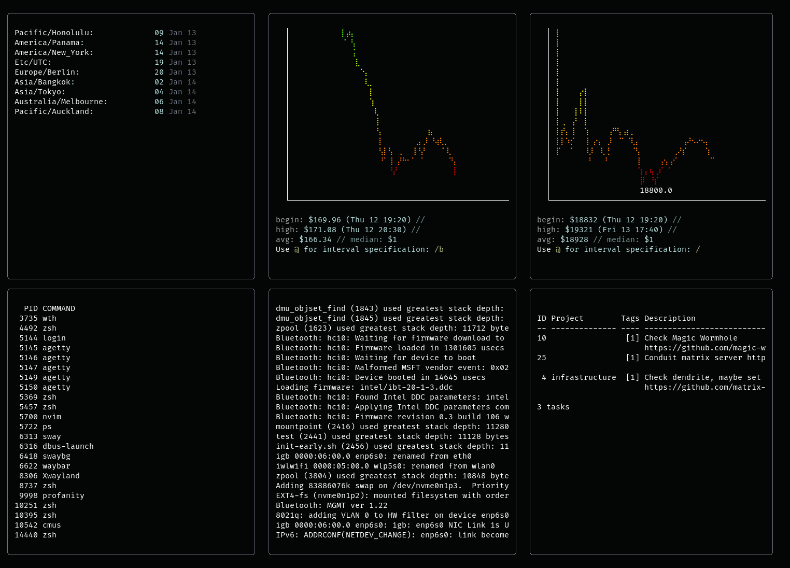

WTH
---

WTH (aka *What The Heck*) is **the better** personal information dashboard for 
your terminal, providing at-a-glance access to stats and data. It's a modular 
and extensible alternative to [WTF](https://github.com/wtfutil/wtf) and it's 
based on [Bubble Tea](https://github.com/charmbracelet/bubbletea).

WTH uses [stickers](github.com/76creates/stickers) to render the dashboard, 
meaning it's *fully responsive* to size changes and automatically adjusts widget 
proportions.

Unlike WTF, WTH modules are **actual** modules (read: shared objects), meaning 
everyone can extend WTH without the need to change the code in this repository. 
WTH offers [libwth](https://github.com/mrusme/libwth) for module development. An 
example module can be found 
[here](https://github.com/mrusme/wth/tree/master/modules/example).

WTH also offers a [command 
module](https://github.com/mrusme/wth/tree/master/modules/command) that allows 
running arbitrary commands and displaying their output as WTH widget on the 
dashboard. Paired with [Gum](https://github.com/charmbracelet/gum) it's possible 
to develop WTH widgets as plain shell scripts.

More native modules are going to become available over time. Also the `command` 
module will soon gain the ability to read especially formatted command output 
and transform it into native [Bubble Tea 
Bubbles](https://github.com/charmbracelet/bubbles) and [Lip Gloss 
styles](https://github.com/charmbracelet/lipgloss).
